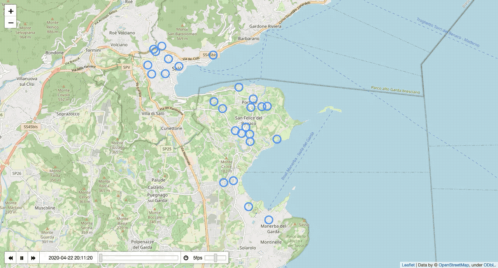

# Capacitated Vehicle Routing Problem

Logistics: optimize delivery of goods by minimizing the total distance. The notebook contains an example of CVRP implemented using CPLEX as solver and map visualization with Folium.

- From address -> get latitude and longitude with **Google Geocoding API**
- Create distance matrix calculating distances with **Google Distance API** (store duration/distance and polylines for plotting)
- Solve optimisation problem with **docplex** (IBM Decision Optimization CPLEX Modeling for Python)
- Display results with **Folium** and the **TimestampedGeoJson** plugin

|:--:|
| Optimal path followed by courier to deliver goods when total distance is minimized. In this example the courier needs to go back to the depot 3 times in order to deliver of all the goods.|
